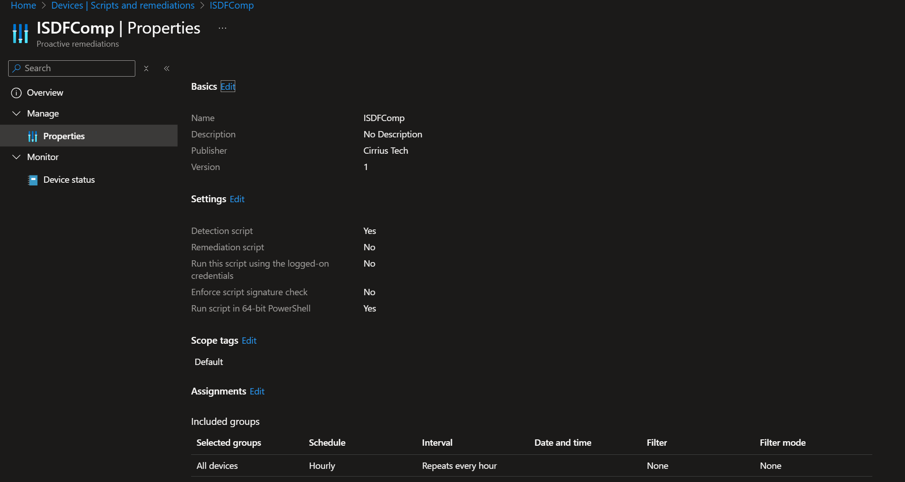

# ISDF – CloudSync Mode Deployment Guide

CloudSync adds a **cloud truth source**. The endpoint posts a signed **ISDF payload** over **mutual TLS (mTLS)** to **API Management**, which forwards to a **Logic App**. The Logic App (via **Managed Identity**) writes canonical values into **Entra ID device `extensionAttributes`**. This allows a  comparison of cloud vs local signatures as well as a device channel/class that is useful for more reliable device filtering than some of the more commonly used out of the box filters such as `device.model` and `device.displayName`.

**High‑level flow:** Device → mTLS → **APIM** → internal → **Logic App** → **Microsoft Graph** → **Entra device extensionAttributes**.


## Prerequisites

- Azure subscription + resource group.
- Permissions: Owner (RG) to deploy, **Global Admin** (or privileged admin) to grant Graph **Application** permissions.
- **Cloud PKI** capable of issuing **client‑auth certificates** to devices (see *CloudSync‑PKI*).

## Deploy order

1. **Logic App** — deploy and enable **System‑assigned Managed Identity** and Graph permissions.  
   See **[CloudSync-LogicApp.md](./CloudSync/CloudSync-LogicApp.md)**.
2. **API Management** — front the Logic App, **require mTLS**, and apply the ISDF policy.  
   See **[CloudSync-APIM.md](./CloudSync/CloudSync-APIM.md)**.
3. **Cloud PKI** — issue client auth certs to devices and publish the CA chain to APIM.  
   See **[CloudSync-PKI.md](./CloudSync/CloudSync-PKI.md)**.
4. **Intune device config** — set ISDF to **Cloud** mode and provide the **Webhook URL** (APIM `/isdf`).

## Configure devices for CloudSync

Set **mode** and the **WebhookUrl** in the registry (delivered by a small configuration script or CSP):

```powershell
New-Item -Path 'HKLM:\SOFTWARE\ISDF' -Force | Out-Null
New-ItemProperty -Path 'HKLM:\SOFTWARE\ISDF' -Name 'Mode' -Value 'Cloud' -PropertyType String -Force | Out-Null
New-ItemProperty -Path 'HKLM:\SOFTWARE\ISDF' -Name 'WebhookUrl' -Value 'https://<your-apim-host>/isdf' -PropertyType String -Force | Out-Null
# Optional: TTL for sync freshness (hours)
New-ItemProperty -Path 'HKLM:\SOFTWARE\ISDF' -Name 'SyncTTLHours' -Value 24 -PropertyType DWord -Force | Out-Null
```

Ensure a **client‑auth certificate** exists in **LocalMachine\My** (EKU *Client Authentication*, valid, with the expected issuer). The detection script automatically picks it up and will POST over mTLS using:

```http
POST /isdf HTTP/1.1
Content-Type: application/json
```

**Request schema (excerpt)** – see `deployments/api/isdfwriter-la.openapi.yaml`:

```json
{
  "device": {
    "aadDeviceId": "GUID",
    "hostname": "NAME",
    "aadTenantId": "GUID"
  },
  "isdf": {
    "channel": "ISDF:W365|DevBox|AVD|DevTestLabs|AzureVM",
    "ea2": "<base64 of protected signal>",
    "signalHash": "<sha256 hex>",
    "originTupleHash": "<sha256 hex>",
    "baselineVer": 2,
    "timestampUtc": "2025-09-01T12:34:56Z"
  }
}
```

**Cloud write mapping** (Logic App → Entra device):

- `extensionAttribute1` = `originTupleHash`
- `extensionAttribute2` = `channel`
- `extensionAttribute3` = `signalHash`
- `extensionAttribute4` = `baselineVer` (string)
- `extensionAttribute5` = `timestampUtc`

After a successful sync the device evaluates extra booleans: `ISDF_WebhookConfigured`, `ISDF_WebhookLastOk`, `ISDF_EA1_Matches`, `ISDF_EA2_Matches`, `ISDF_LastSyncFresh`.

## Compliance policy (CloudSync)

Use **Custom Compliance** with discovery script `scripts/ISDFDetect.ps1` and **import** the rules from `policy/ISDF_Compliance_Cloud.json` (13 rules):  
ISDF_ChannelOk, ISDF_TenantIdOK, ISDF_AzEnvOk, ISDF_HostnameMatchesProvisioned, ISDF_SystemManufacturerOk, ISDF_SystemProductNamePrefixOk, ISDF_EA2_Decrypts, ISDF_LiveEqualsDecrypted, ISDF_WebhookConfigured, ISDF_WebhookLastOk, ISDF_EA1_Matches, ISDF_EA2_Matches, ISDF_LastSyncFresh.




See the sub‑guides for infrastructure setup:
- **APIM:** [CloudSync-APIM.md](./CloudSync/CloudSync-APIM.md)
- **Logic App:** [CloudSync-LogicApp.md](./CloudSync/CloudSync-LogicApp.md)
- **PKI:** [CloudSync-PKI.md](./CloudSync/CloudSync-PKI.md)
