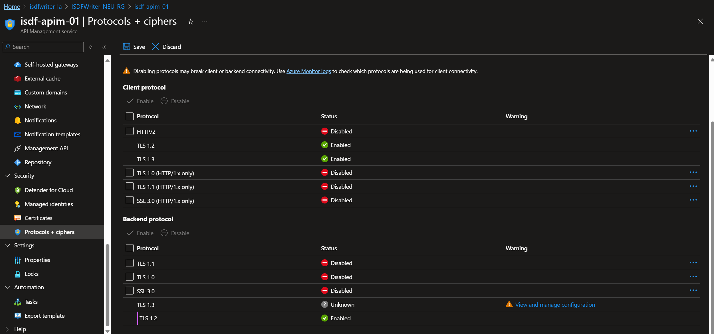
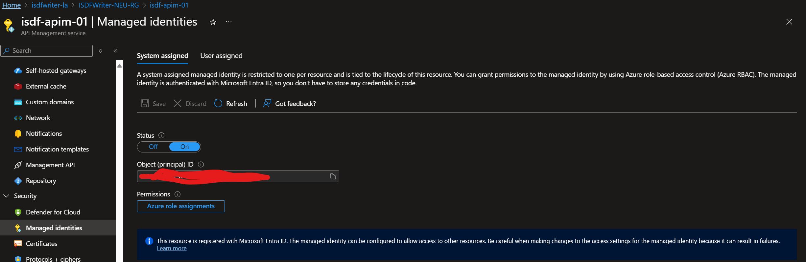
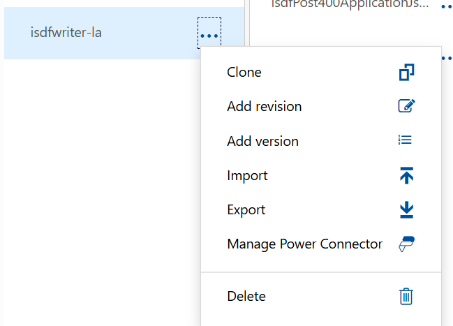
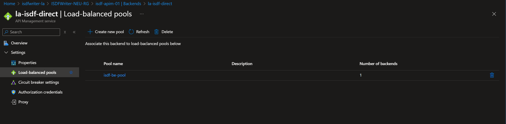
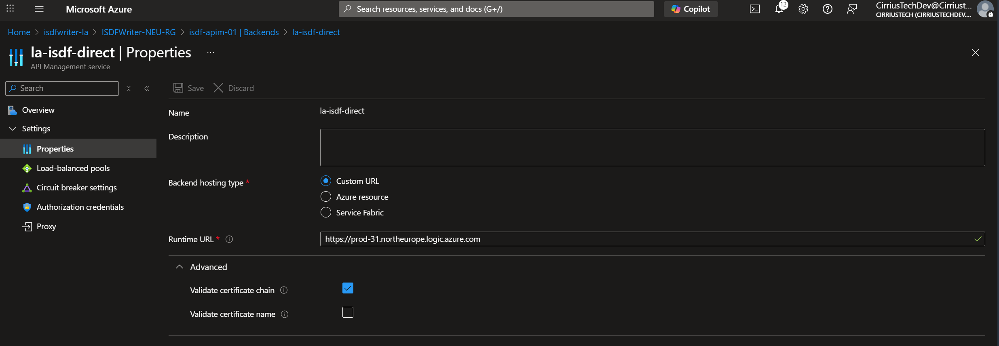

# CloudSync Infrastructure – API Management (APIM)

APIM terminates **mTLS** from devices, applies security policy, and forwards to the Logic App using **Managed Identity**. The supplied policy (`policy/idsf_apim_policy.xml`) enforces client cert presence/validity and stamps useful headers.







Also create an App Registration in Entra and note the **Application ID URI** in the format `api://{Application (client) id}`. This should replace the **APPREG_URI** in tHe APIM policy. This is used by APIM as part of the OAuth claim when it calls the logic app.

## Option A — Quick deploy via ARM

1. Edit **`deployments/arm/template-ISDFWriter-APIM/parameters.json`** and set:
   - `service_isdf_apim_01_name` — APIM service name (e.g., `isdf-apim-ne`).
   - `apis_isdfwriter_la_path` — API path segment (e.g., `isdf`).
   - `backends_isdf_be_pool_url` — your Logic App base URL (no SAS).
   - `backends_isdf_be_pool_protocol` — `https`.
   - Publisher/contact values as appropriate.
2. Deploy:
```bash
az group create -n <rg> -l <region>
az deployment group create -g <rg> \
  -f deployments/arm/template-ISDFWriter-APIM/template.json \
  -p @deployments/arm/template-ISDFWriter-APIM/parameters.json
```

> You can also deploy the **Bicep** module `deployments/bicep/isdf_apim.bicep` if you prefer infrastructure as code.

## Option B — Manual configuration steps

1. **Create APIM** (Consumption/Dev/SKU of your choice). Enable **`negotiateClientCertificate`** on the proxy hostname.
2. **Certificates → CA certificates:** upload your **Root** and **Issuing** CA for device auth (see PKI guide).
3. **APIs → Import**: import `deployments/api/isdfwriter-la.openapi.yaml`.
4. **Backends:** create a backend pointing to your Logic App base URL and enable **certificate chain validation**.
5. **API → Inbound policy:** paste `policy/idsf_apim_policy.xml`. This:
   - Rejects requests **without a client certificate**.
   - Validates not‑before/not‑after and thumbprint/issuer (customizable).
   - Sets correlation and client certificate headers.
   - Uses **Managed Identity** to auth to the Logic App (no SAS keys).
6. Note your **public endpoint**: `https://<apim-host>/<apis_isdfwriter_la_path>` → this is the **WebhookUrl** for devices.

**Hardening tips**
- Disable legacy TLS (TLS 1.0/1.1/SSL3) and weak ciphers.
- Prefer **private networking** to the Logic App (VNET/Private link) if available.
- Rate‑limit and add **IP restrictions** if your fleet has known egress ranges.
