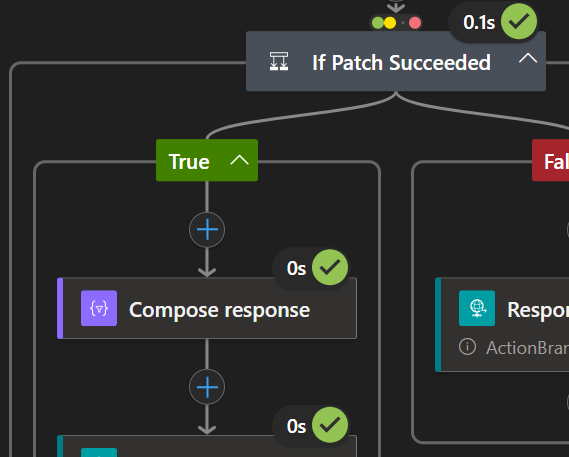
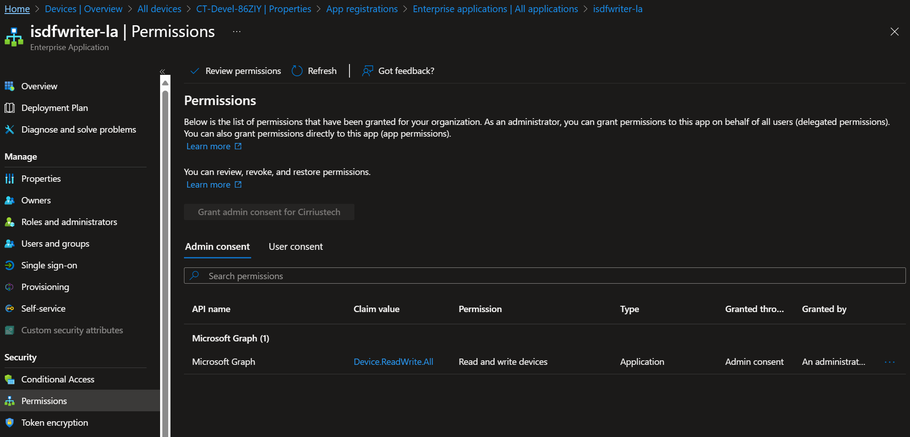
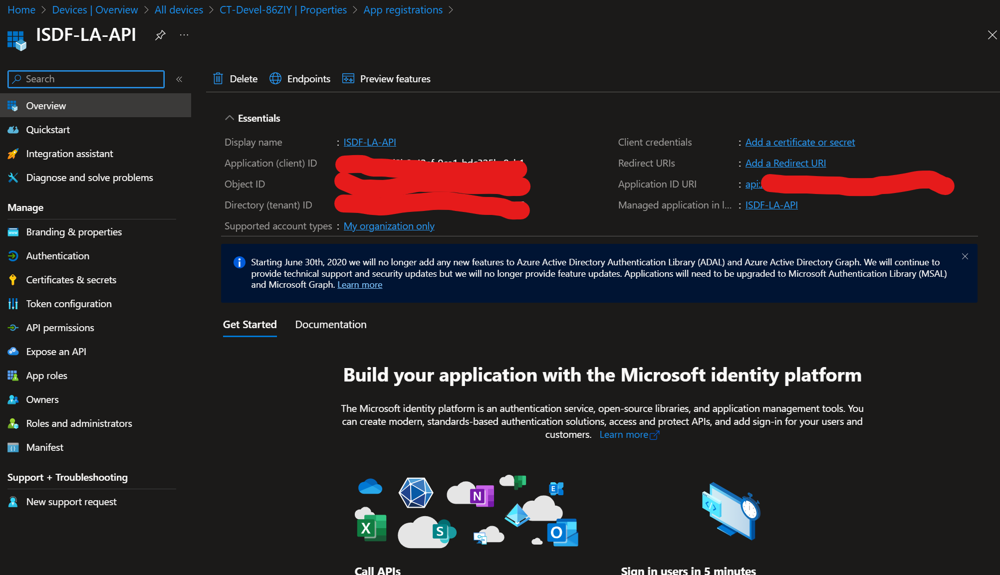
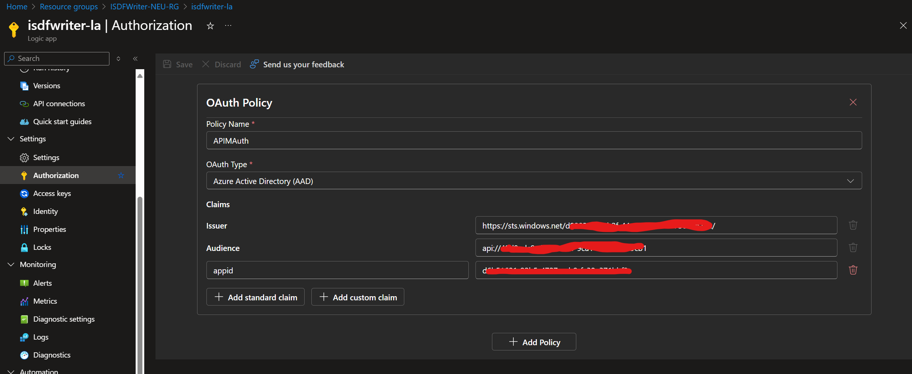

# CloudSync Infrastructure – Logic App

The Logic App validates the request and writes canonical values to the **Entra device** using **Managed Identity**.





## Deploy

**Option A — ARM**

```bash
az group create -n <rg> -l <region>
az deployment group create -g <rg> \\
  -f deployments/arm/template-ISDFWriter-LogicApp/template.json \\
  -p @deployments/arm/template-ISDFWriter-LogicApp/parameters.json \\
  -p workflows_isdfwriter_la_name=isdfwriter-la
```

**Option B — Bicep**

```bash
az deployment group create -g <rg> -f deployments/bicep/isdfwriter_la.bicep
```

## Configure Managed Identity → Microsoft Graph

1. In the Logic App blade, enable **System-assigned identity**.
2. In **Microsoft Entra admin center → App registrations → Enterprise applications →** find the Logic App’s **Managed Identity**.
3. **API permissions → Add a permission → Microsoft Graph → Application permissions**:
   - **`Device.ReadWrite.All`** (recommended minimal)  
     *(Some tenants instead grant `Directory.ReadWrite.All`.)*
4. Click **Grant admin consent**.
5. No client secrets are required — the Logic App uses its **Managed Identity** directly.

## Configure OAuth Authentication Policy

1. **Logic App → Settings → Authorization**:
  - **Policy Name**: Any name you want
  - **OAuth Type**: `Azure Active Directory (AAD)`
  - **Issuer**: `https://sts.windows.net/{tenantId}/`
  - **Audience**: `{appRegURI}`
  - Click on **Add custom claim**
  - **claim name**: `appid`
  - **claim value**: `{apimManagedIdentityAppId}`
  

## How the workflow maps fields

From the HTTP trigger (schema in `deployments/bicep/isdfwriter_la.bicep` / `deployments/api/isdfwriter-la.openapi.yaml`), the workflow:

- Looks up the Entra device:  
  `GET https://graph.microsoft.com/v1.0/devices?$filter=deviceId eq '{aadDeviceId}'`
- Builds a PATCH body:
```json
{ "extensionAttributes": {
    "extensionAttribute1": "{originTupleHash}",
    "extensionAttribute2": "{channel}",
    "extensionAttribute3": "{signalHash}",
    "extensionAttribute4": "{baselineVer}",
    "extensionAttribute5": "{timestampUtc}"
}}
```
- **PATCH** the device by **id** (not deviceId):  
  `PATCH https://graph.microsoft.com/v1.0/devices/{id}`

On success it returns `{ "syncResult": "Success", "processedAtUtc": "...", "echo": {...} }` which the device uses to assert **webhook freshness** and **hash matches**.
