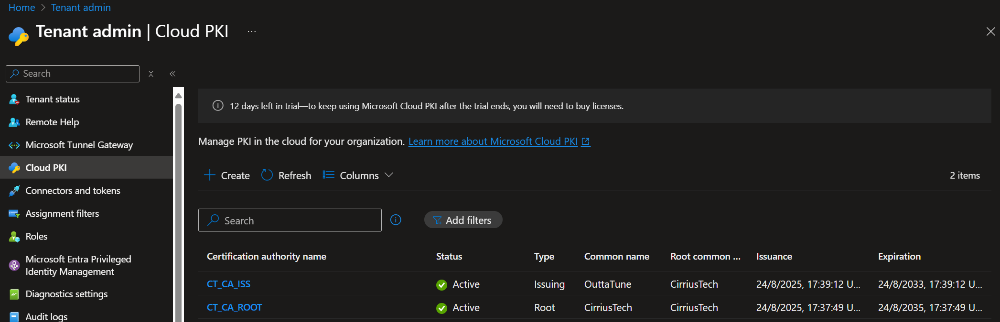
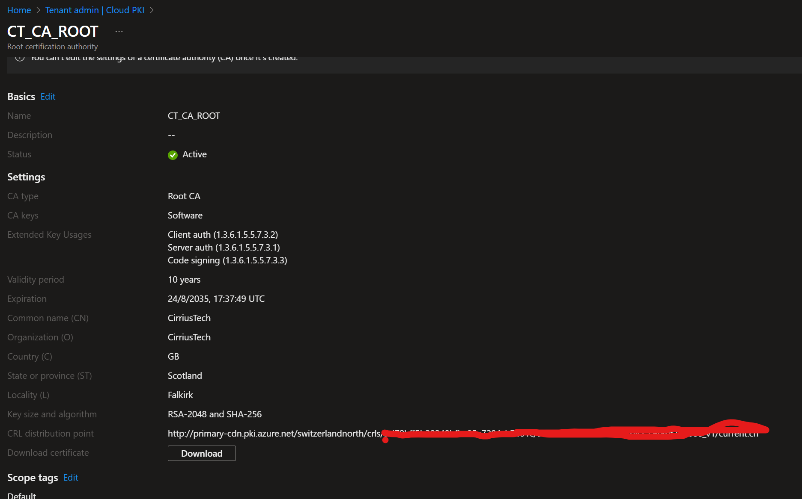
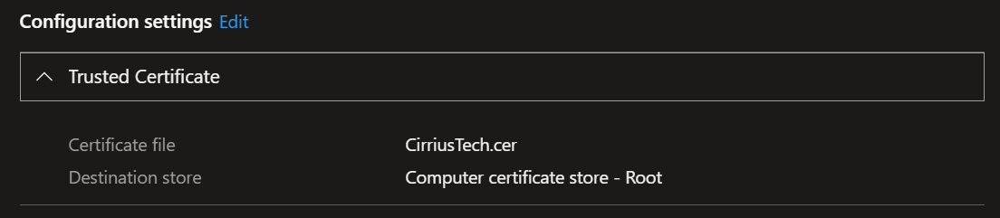
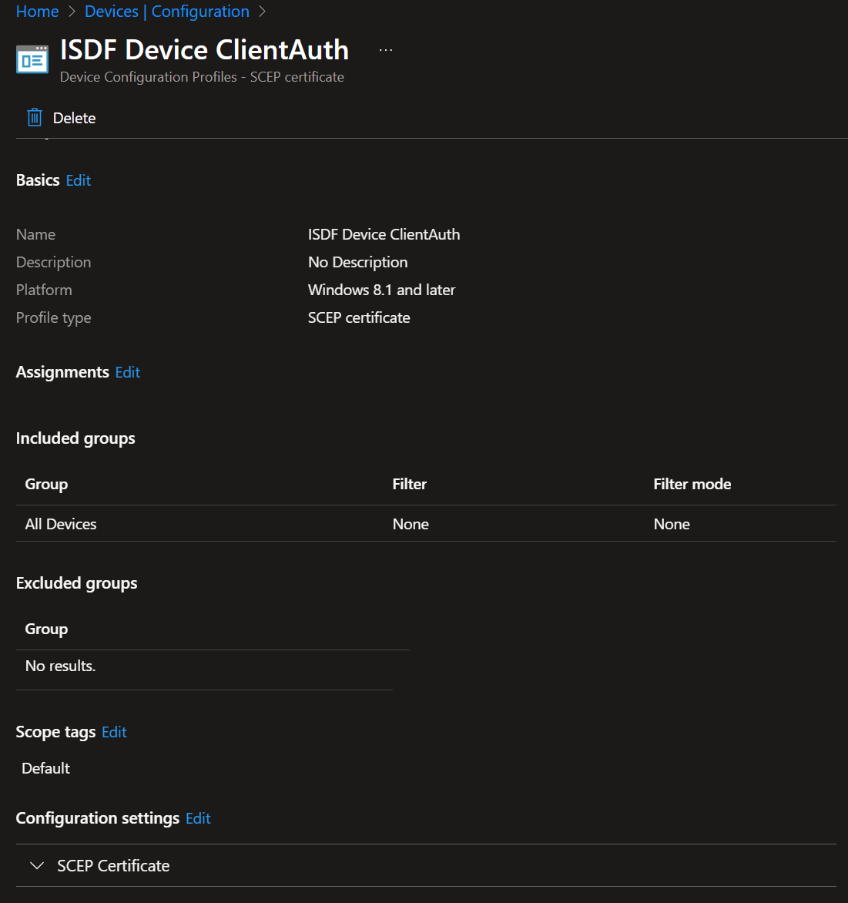

# CloudSync Infrastructure – Cloud PKI & Device Certificates

Devices must present a **Client Authentication** certificate for **mTLS** to APIM. Intune Cloud PKI (e.g., **Keyfactor**) is a convenient way to issue and rotate these.

## Steps

1. **Publish Root/Issuing CA** to devices via Intune (**Trusted certificate** profiles).
2. Create a **PKCS** (or **SCEP**) **device** certificate profile with EKU **Client Authentication (1.3.6.1.5.5.7.3.2)**.
3. Target the profile to the ISDF devices (Cloud PCs, Dev Boxes, AVD, etc.).
4. In **APIM → Certificates**, upload the **CA chain** so APIM can validate client certs.
5. Ensure the certificate lands in **LocalMachine\My** and is **valid**. The ISDF detector auto‑selects a cert with ClientAuth EKU.

> The detector searches LocalMachine/CurrentUser \\**My** stores for a valid client‑auth certificate. If you restrict issuance to device context only, that’s fine — it checks LocalMachine first.

By default the detector looks for issuer CNs that **contain** `CN=ISSUER` or `CN=ROOT`. You must customize this to your root and issuing CA CNs.

This narrows which certificates are eligible for mTLS.
