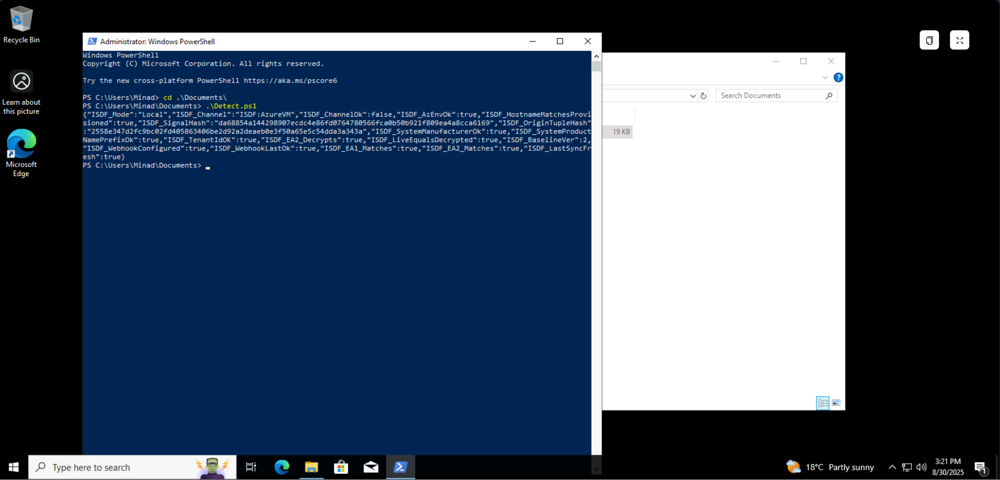
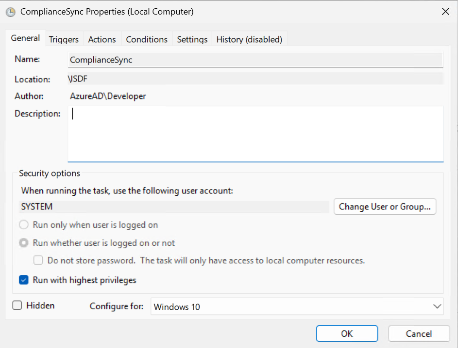
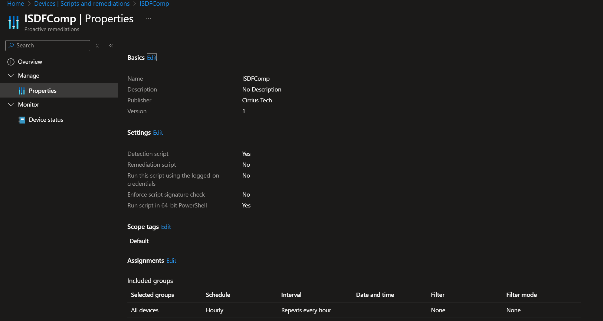
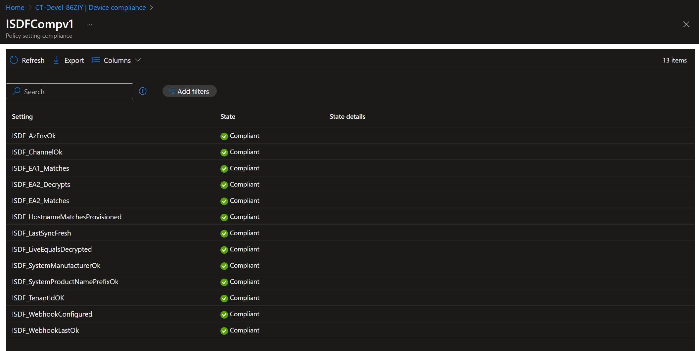
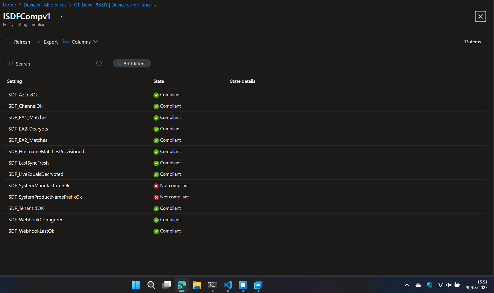
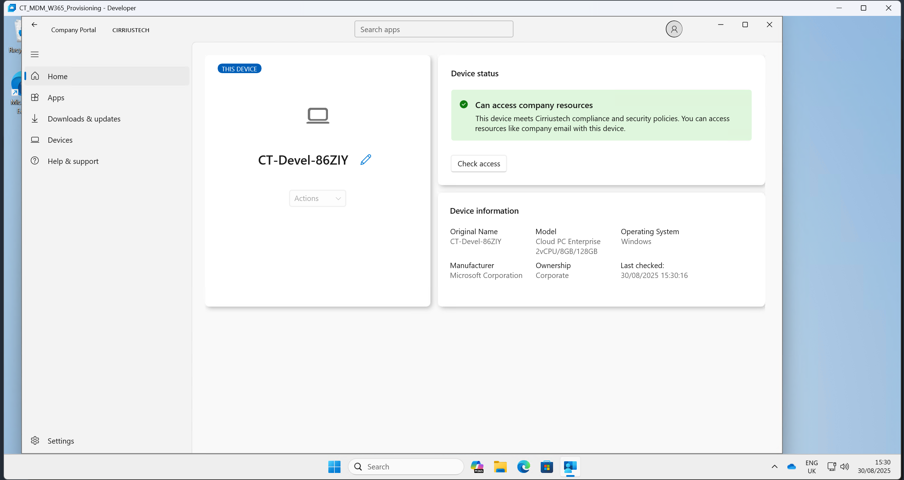
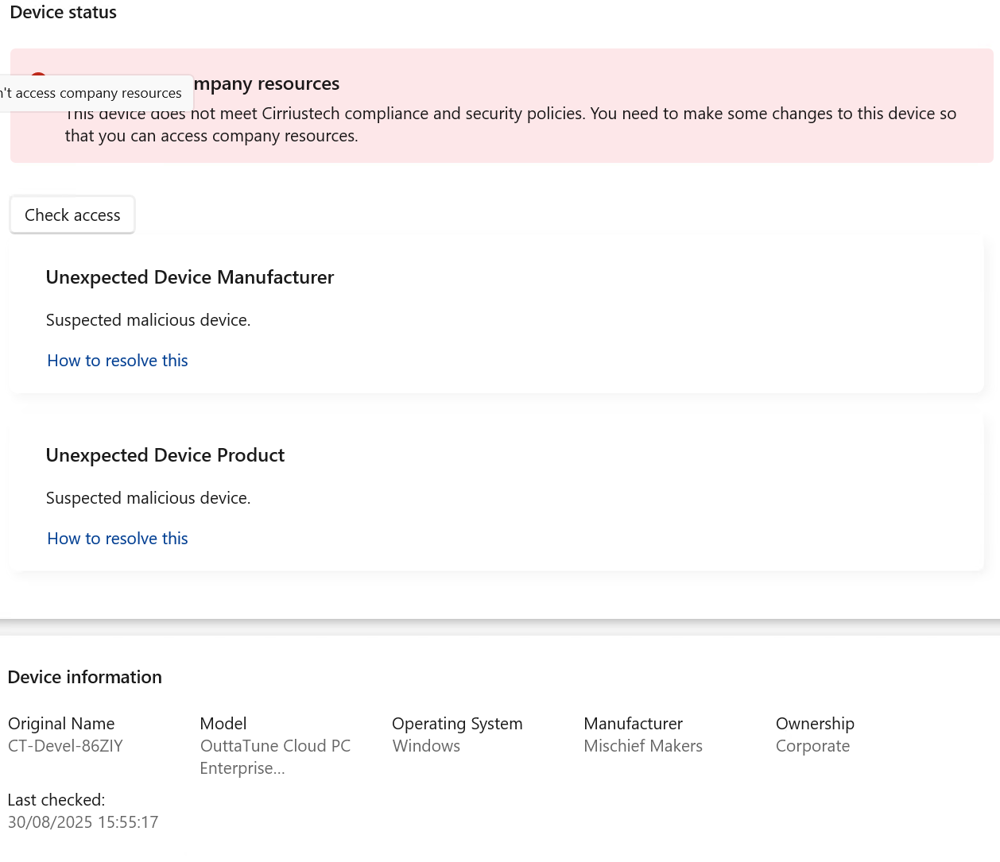

# ISDF – Local Mode Deployment Guide

Local Mode keeps validation **entirely on the endpoint**. The detection script derives a device **channel** (W365, DevBox, AVD, DevTestLabs, or Azure VM) from IMDS/metadata, builds a **signed signal**, proves it can **decrypt** what it just encrypted (anti‑tamper), and evaluates baseline rules. No cloud round‑trip is required.

## What you get

- **Zero cloud dependencies** and no additional Azure cost.
- **Fast feedback** — compliant/non‑compliant within minutes.
- **Tamper‑resistance** — the device must prove it can decrypt its own canonical signal.

## Prerequisites

- Windows 10/11 devices **managed by Intune**.
- Roles: **Intune Administrator** (to deploy Proactive Remediations & Custom Compliance).
- Scripts from this repo:
  - `scripts/ISDFDetect.ps1` — *discovery* script that emits ISDF JSON and exits **0/1**.
  - `scripts/ISDF_PR_Detection.ps1` — lightweight PR *detection*.
  - `scripts/ISDF_PR_Watchdog.ps1` — schedules compliance sync nudges.

## Step 1 — Deploy Proactive Remediation (optional but recommended)

1. Intune Admin Center → **Devices → Scripts → Proactive remediations** → *Create script package*.
2. **Detection script:** upload `scripts/ISDF_PR_Detection.ps1` 
3. **Run as 64‑bit PowerShell** and **run as system**. 

4. **Schedule:** every **1 hour minutes** (Intune lower bound) 

5. Intune Admin Center → **Devices → Scripts → Proactive remediations** → *Create script package*.
6. **Detection script:** upload `scripts/ISDF_PR_Watchdog.ps1` 
7. **Run as 64‑bit PowerShell** and **run as system**. 

8. **Schedule:** every **1 hour minutes** (Intune lower bound) 

> The watchdog creates a Scheduled Task that triggers PushLaunch / Schedule #3 and an IME compliance sync to tighten feedback loops. It forces it to run every 15 minutes thereby ensuring that any tampering with the registry to bypass Entra device filters based on model/hostname will mark the device noncompliant within 15 minutes at most. thereby failing any CA policy that requires a compliant device.

## Step 2 — Create a Custom Compliance policy (Local)

1. Intune Admin Center → **Devices → Compliance policies → Scripts → Add**.
2. **Discovery script:** paste contents of  `scripts/ISDFDetect.ps1` (this emits an ISDF JSON payload).  
3. **JSON rules:** create a policy with **compliance rules**. Use the cloud JSON as a model (`policy/ISDF_Compliance_Cloud.json`) - in local mode the script forces the CloudSync‑only checks to return `true`:
   - `ISDF_WebhookConfigured`, `ISDF_WebhookLastOk`, `ISDF_EA1_Matches`, `ISDF_EA2_Matches`, `ISDF_LastSyncFresh`.

> Local‑mode rules typically include:  
`ISDF_ChannelOk`, `ISDF_TenantIdOK`, `ISDF_AzEnvOk`, `ISDF_HostnameMatchesProvisioned`, `ISDF_SystemManufacturerOk`, `ISDF_SystemProductNamePrefixOk`, `ISDF_EA2_Decrypts`, `ISDF_LiveEqualsDecrypted`.

## What the device proves (signals & booleans)

- **Channel derivation** from IMDS + tags (W365/DevBox/AVD/DevTestLabs/AzureVM).
- **`SignalProtected_v2`** and **`ChannelProtected_v2`** written to `HKLM:\SOFTWARE\ISDF`.
- **`ISDF_EA2_Decrypts`** and **`ISDF_LiveEqualsDecrypted`** confirm it can decrypt its own canonical signal and that plaintext matches the live view.
- Other booleans assert hostnames, tenant, manufacturer/product prefixes, and Azure environment tags.

Compliance shows standard green/red results in Intune and in Company Portal.

